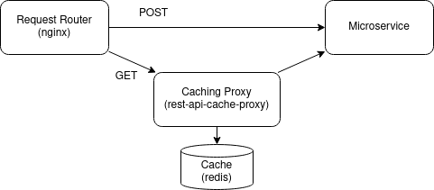

# exaple of rest-api-cache-proxy configuration

- Request Router (nginx): route GET requests to the Caching Proxy and others requests directly to Microservice
- Caching Proxy: cache responses for number of second specified in 'Cache-Control-TTL' tag 
- Cache (redis): allow scalability of Caching Proxy (you can setup more that one instance)
- Microservice: simple service with GET and POST REST API

See configuration [here](docker-compose.yml)